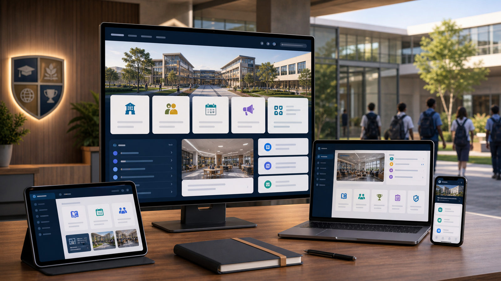
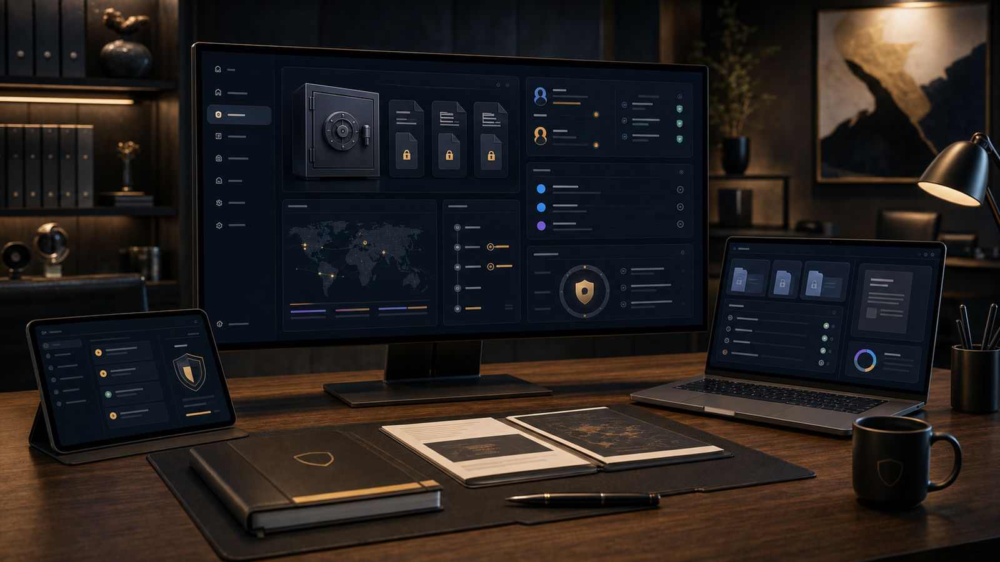
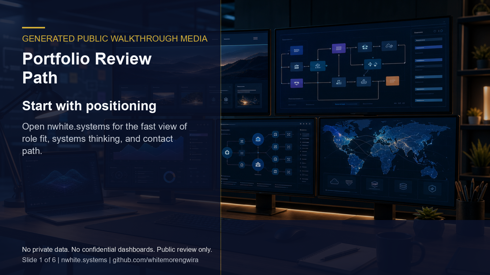
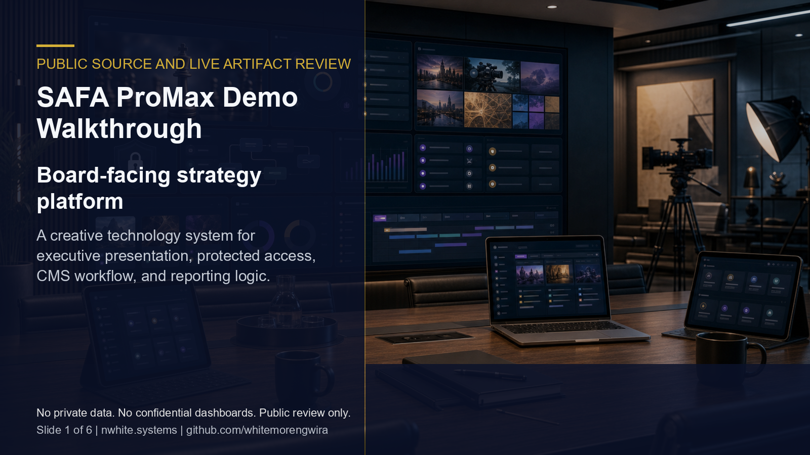
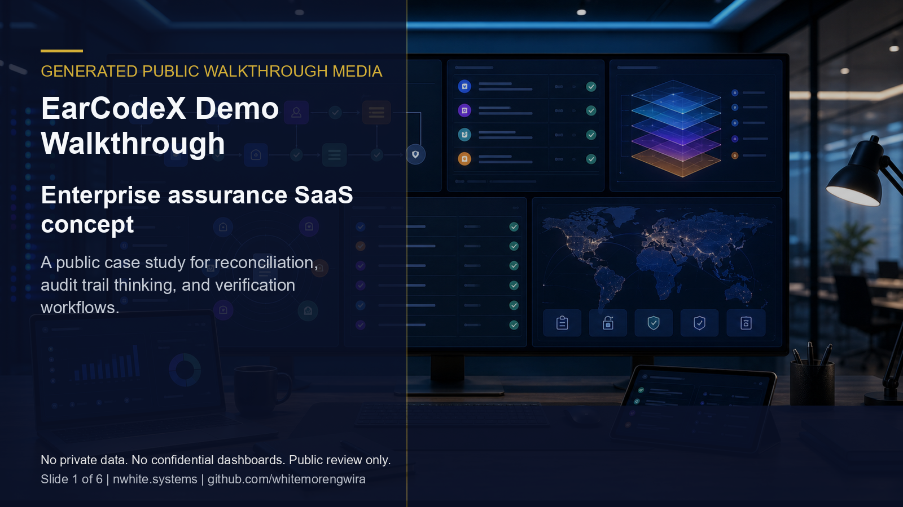

# NWhite Systems

**Public portfolio and technical showcase for Whitemore Ngwira**

NWhite Systems is my recruiter-facing portfolio index for selected full-stack, AI workflow, analytics, cloud, and creative technology work.

## Public Review Entry Points

- **Portfolio website:** https://nwhite.systems
- **Recruiter review guide:** [docs/recruiter-review-guide.md](docs/recruiter-review-guide.md)
- **Current recruiter proof path:** [docs/current-recruiter-proof-path.md](docs/current-recruiter-proof-path.md)
- **One-page recruiter PDF:** [Whitemore Ngwira - Selected Systems Portfolio](docs/assets/recruiter-pack/Whitemore-Ngwira-Selected-Systems-Portfolio.pdf)
- **Architecture notes:** [docs/architecture-notes.md](docs/architecture-notes.md)
- **Systems architecture proof log:** [docs/systems-architecture-proof-log.md](docs/systems-architecture-proof-log.md)
- **Live portfolio index:** [docs/live-portfolio-index.md](docs/live-portfolio-index.md)
- **Recruiter outreach kit:** [docs/recruiter-outreach-kit.md](docs/recruiter-outreach-kit.md)
- **GitHub Free hygiene notes:** [docs/github-free-hygiene.md](docs/github-free-hygiene.md)
- **GitHub profile:** https://github.com/whitemorengwira
- **Professional contact:** [hello@nwhite.systems](mailto:hello@nwhite.systems?subject=Portfolio%20walkthrough%20request)

## 90-Second Evidence Route

| Hiring need | Public evidence |
|---|---|
| Fast orientation | [Portfolio website](https://nwhite.systems) for positioning, selected work, and contact path |
| Guided overview | [Portfolio review walkthrough](docs/assets/demo/portfolio-review-path.mp4) for a quick public evidence route |
| Source-level proof | [SAFA ProMax](https://github.com/whitemorengwira/safa-promax) for Next.js/TypeScript delivery evidence |
| Architecture proof | [Systems architecture proof log](docs/systems-architecture-proof-log.md) for date-stamped public decisions and verification |
| Internal hiring review | [One-page recruiter PDF](docs/assets/recruiter-pack/Whitemore-Ngwira-Selected-Systems-Portfolio.pdf) for compact hiring-manager context |
| Deeper discussion | [Portfolio walkthrough request](mailto:hello@nwhite.systems?subject=Portfolio%20walkthrough%20request) where confidentiality allows |

## What This Repository Shows

This repository gives employers a clean path through public work without exposing client-sensitive implementation detail. It links to live products, presentation systems, and sanitized case studies that demonstrate practical delivery across software architecture, public-facing UX, workflow design, documentation, and deployment.

Production code, credentials, private dashboards, commercial records, and stakeholder data are not published here unless a project has been explicitly prepared for public review.

## Current Profile Alignment

As of June 7, 2026, this public proof path is aligned around systems architecture, cloud-first delivery, AI-assisted workflow design, full-stack platforms, analytics, and multimedia/content systems. My current Socinga Africa role is represented as Principal Systems Architect and Digital Infrastructure Lead, alongside my independent N.White Systems practice and public portfolio evidence.

## Portfolio Signals

| Signal | Evidence |
|---|---|
| Full-stack platform delivery | Next.js, TypeScript, API, deployment, admin, and content workflow experience |
| AI and workflow architecture | AI-assisted operations, automation planning, and human-in-the-loop process design |
| Analytics and reporting | Measurement planning, dashboard thinking, event design, and quality control |
| Creative technology | Interactive strategy sites, multimedia systems, branded digital experiences, and stakeholder presentations |
| Regulated-sector awareness | Insurance, mining, education, investment, governance, confidentiality, and controlled-access systems |

## Role-Specific Evidence

| Hiring lens | Best first evidence |
|---|---|
| Systems architect | [Architecture notes](docs/architecture-notes.md), [systems architecture proof log](docs/systems-architecture-proof-log.md), and [N.White Systems case study](docs/case-studies/nwhite-systems.md) |
| Full-stack/product engineer | [SAFA ProMax source](https://github.com/whitemorengwira/safa-promax), build/audit proof, and the SAFA demo walkthrough |
| AI workflow builder | [EarCodeX](docs/case-studies/earcodex.md), [Cineterns](docs/case-studies/cineterns.md), and controlled workflow case studies |
| Digital transformation / stakeholder systems | [Socinga Africa](docs/case-studies/socinga-africa-enterprise.md), [SAM Dossier](docs/case-studies/sam-dossier.md), and mining/investor workflow examples |

## Visual Gallery

_Generated portfolio visuals below are illustrations for public review; they are not confidential product screenshots._

| Case study | Generated portfolio visual |
|---|---|
| [Socinga Africa Enterprise Website](docs/case-studies/socinga-africa-enterprise.md) |  |
| [SAFA ProMax](docs/case-studies/safa-promax.md) |  |
| [EarCodeX SaaS Prototype](docs/case-studies/earcodex.md) |  |
| [Oasis College Smart Website Prototype](docs/case-studies/oasis-college-promax.md) |  |
| [SAM Dossier](docs/case-studies/sam-dossier.md) |  |
| [Socinga Africa Mining Hub](docs/case-studies/socinga-mining-hub.md) |  |

## Demo Walkthroughs

_Generated public walkthrough media below uses public screenshots and generated portfolio visuals only. It does not show private dashboards, credentials, records, or confidential workflows._

| Walkthrough | Preview |
|---|---|
| [Portfolio review path](docs/assets/demo/portfolio-review-path.mp4) |  |
| [SAFA ProMax public source review](docs/assets/demo/safa-promax-demo.mp4) |  |
| [EarCodeX regulated workflow review](docs/assets/demo/earcodex-demo.mp4) |  |

## Selected Work

- [Socinga Africa Enterprise Website](docs/case-studies/socinga-africa-enterprise.md)
- [N.White Systems Personal Architecture Website](docs/case-studies/nwhite-systems.md)
- [SA Film Interns / Cineterns Prototype](docs/case-studies/cineterns.md)
- [EmpowaYouth Presentation Prototype](docs/case-studies/empoweryouth.md)
- [Oasis College Smart Website Prototype](docs/case-studies/oasis-college-promax.md)
- [EarCodeX SaaS Prototype](docs/case-studies/earcodex.md)
- [Socinga Africa Mining Hub](docs/case-studies/socinga-mining-hub.md)
- [Socinga Africa Mining Investment Mandate](docs/case-studies/socinga-africa-mining.md)
- [Complete Grade Suite Mini E-Commerce](docs/case-studies/complete-grade-suite.md)
- [SAM Dossier](docs/case-studies/sam-dossier.md)
- [SAFA ProMax](docs/case-studies/safa-promax.md)

## Public Verification Signals

_Date-stamped for recruiter context: verified on June 7, 2026._

- Six public showcase repositories are curated for recruiter review with clean default branches.
- GitHub social preview images are uploaded across all six showcase repositories, and profile pins are ordered for a clear review path.
- Current profile language is aligned to the verified Socinga Africa title: Principal Systems Architect and Digital Infrastructure Lead.
- SAFA ProMax passed `npm run lint -- --max-warnings=0`, `npm run typecheck`, `npm run build`, and `npm audit --omit=dev` before this conversion layer.
- The SAFA ProMax PostCSS/Next security alert was handled through a safe update/override path.
- GitHub Free hygiene is active across the showcase repos: community files, copyright/usage boundaries, light branch protection, disabled noisy tabs, release tags, public verification workflows, Dependabot security updates, secret scanning, push protection, and private vulnerability reporting.
- Public case studies label generated visuals clearly and avoid credentials, private dashboards, internal workflow notes, student records, investor records, and client-sensitive data.

## Monthly Proof Rhythm

The [systems architecture proof log](docs/systems-architecture-proof-log.md) keeps monthly public evidence concise: problem, decision, tradeoff, verification, and review link. It is intentionally factual rather than promotional.

## Request Walkthrough

Recruiters and hiring teams can start with the live portfolio, then use the case studies to review role, architecture, delivery signals, and confidentiality boundaries. The [one-page recruiter PDF](docs/assets/recruiter-pack/Whitemore-Ngwira-Selected-Systems-Portfolio.pdf) is available for internal hiring review, and [portfolio walkthrough requests](mailto:hello@nwhite.systems?subject=Portfolio%20walkthrough%20request) are welcome where permissions allow.

## Confidentiality

Some projects are represented through sanitized documentation rather than full production source. This protects client trust, stakeholder privacy, credentials, operational workflows, and commercially sensitive material while still giving reviewers clear evidence of role, architecture, delivery, and judgment.

## Usage Rights

This repository is public for portfolio review only and is not open-source licensed. See [COPYRIGHT.md](COPYRIGHT.md) for usage boundaries.
