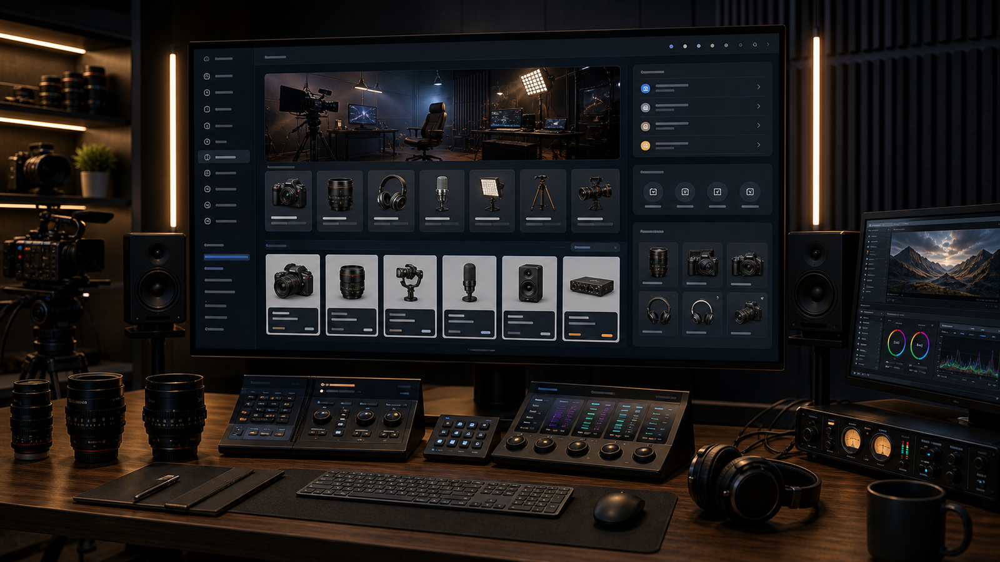
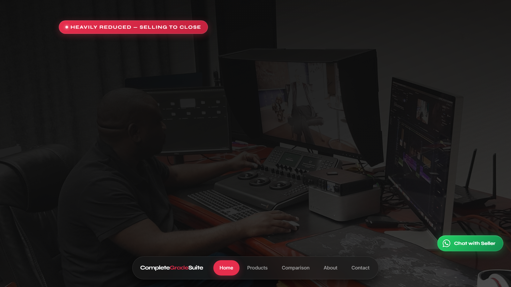

# Complete Grade Suite Mini E-Commerce

**Live artifact:** [https://complete-grade-suite.vercel.app/](https://complete-grade-suite.vercel.app/)  
**Portfolio role:** E-commerce, multimedia equipment, production and studio asset presentation  
**Source posture:** Public mini-commerce prototype with implementation detail summarized for portfolio review.

_Generated portfolio visual; not a confidential product screenshot._

## Public Demo Evidence

_Public live artifact screenshot captured on June 4, 2026._

## Overview

Complete Grade Suite is a compact e-commerce prototype for presenting a professional colour grading and live production equipment package.

## My Role

I structured the product presentation, comparison logic, and sales-oriented user journey so the asset package could be reviewed clearly by potential buyers or stakeholders.

## What This Demonstrates

- E-commerce layout and product comparison thinking.
- Ability to package technical multimedia assets into a buyer-friendly digital experience.
- Practical delivery of a focused public prototype with clear commercial intent.

## Technical Proof

- **Stack and delivery signals:** Public mini-commerce prototype, product comparison structure, conversion-oriented page flow, and multimedia asset positioning.
- **Public evidence:** Product hierarchy, comparison logic, buyer journey, and call-to-action clarity.
- **Confidentiality boundary:** Public review covers the commerce experience and presentation logic. Pricing strategy, ownership details, transaction records, and implementation internals stay controlled where required.

## Public Review Context

The live artifact presents product framing, comparison flow, and call-to-action structure. This case study adds e-commerce and multimedia positioning context behind the prototype.

## Confidentiality

The public artifact is suitable for portfolio review. Pricing, asset ownership, transaction details, and implementation internals should be controlled separately where required.

## Request Walkthrough

Private walkthroughs are available where confidentiality allows: [hello@nwhite.systems](mailto:hello@nwhite.systems?subject=Portfolio%20walkthrough%20-%20Complete%20Grade%20Suite)
