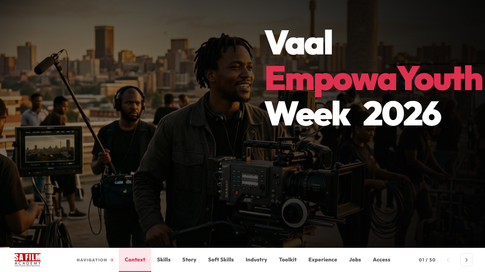

# EmpowaYouth Presentation Prototype

**Live artifact:** [https://empoweryouth.vercel.app/](https://empoweryouth.vercel.app/)  
**Portfolio role:** Youth-development storytelling, public presentation, community-impact communication  
**Source posture:** Public presentation with personal and partner-specific materials kept controlled.

_Generated portfolio visual; not a confidential product screenshot._

## Public Demo Evidence

_Public live artifact screenshot captured on June 4, 2026._

## Overview

EmpowaYouth is a presentation prototype focused on youth development, social-impact storytelling, and stakeholder communication.

## My Role

I shaped the narrative structure, digital presentation flow, and public-facing experience so the initiative could be reviewed as more than a static slide deck.

## What This Demonstrates

- Digital storytelling for community-impact initiatives.
- Ability to convert a presentation concept into an interactive public artifact.
- Stakeholder communication across social, educational, and development themes.

## Technical Proof

- **Stack and delivery signals:** Interactive presentation delivery, narrative architecture, stakeholder-ready public artifact, and responsive storytelling structure.
- **Public evidence:** Story sequence, audience framing, impact communication, and the live artifact's improvement over a static deck.
- **Confidentiality boundary:** Public review covers the communication system. Personal material, partner-specific documents, participant data, and non-public programme details remain controlled.

## Public Review Context

The live artifact presents story flow, structure, and presentation design. This case study adds communication and delivery context behind the prototype.

## Confidentiality

The public artifact is suitable for portfolio review. Personal, partner-specific, or non-public programme materials should remain controlled outside public repositories.

## Request Walkthrough

Private walkthroughs are available where confidentiality allows: [hello@nwhite.systems](mailto:hello@nwhite.systems?subject=Portfolio%20walkthrough%20-%20EmpowaYouth)
