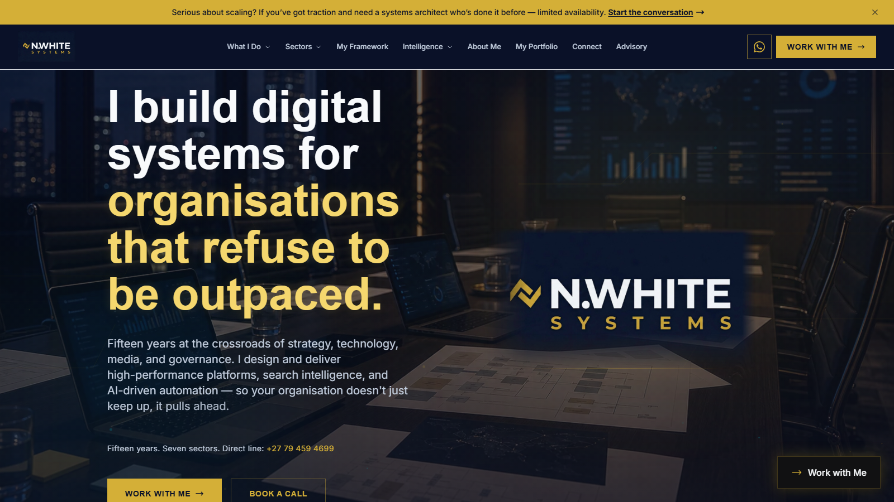

# N.White Systems Personal Architecture Website

**Live artifact:** [https://nwhite.systems/](https://nwhite.systems/)  
**Portfolio role:** Personal portfolio, systems-architecture positioning, digital services website  
**Source posture:** Public website with operational implementation kept controlled.

_Generated portfolio visual; not a confidential product screenshot._

## Public Demo Evidence

_Public live artifact screenshot captured on June 4, 2026._

## Overview

N.White Systems is my primary professional website for systems architecture, AI workflow design, digital strategy, SEO, portfolio positioning, and advisory work.

## My Role

I designed and built the public positioning, service architecture, content structure, and portfolio flow for my own professional brand.

## What This Demonstrates

- Ability to package technical capability into a clear public-facing brand.
- SEO-aware content architecture for professional services.
- Practical delivery across design, copy, deployment, and portfolio strategy.

## Technical Proof

- **Stack and delivery signals:** Portfolio architecture, professional-services positioning, SEO-aware information structure, deployment discipline, and review-path design.
- **Public evidence:** Service taxonomy, selected-work flow, contact path, and the GitHub portfolio's support for the public website.
- **Confidentiality boundary:** Public review should focus on positioning and delivery. Operational dashboards, private experiments, credentials, and commercial planning stay controlled.

## Public Review Context

The live website presents services, positioning, and selected work. This repository adds supporting context for the broader public portfolio.

## Confidentiality

The public website is intended for employer and client review. Operational dashboards, private implementation detail, credentials, and commercial experiments remain controlled separately.

## Request Walkthrough

Private walkthroughs are available where confidentiality allows: [hello@nwhite.systems](mailto:hello@nwhite.systems?subject=Portfolio%20walkthrough%20-%20N.White%20Systems)
