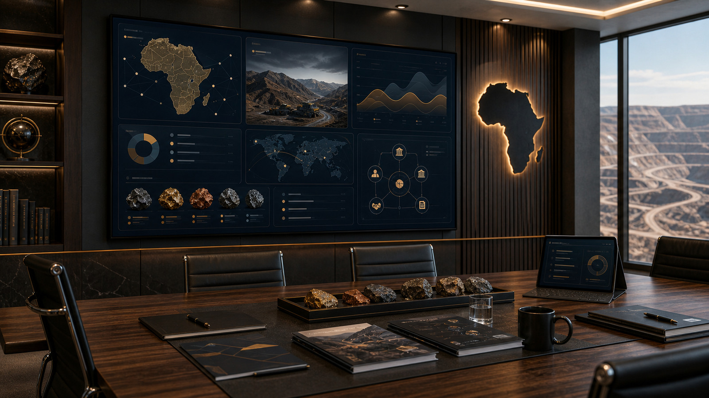

# Socinga Africa Mining Investment Mandate

**Live artifact:** [https://socinga-africa-mining.vercel.app/](https://socinga-africa-mining.vercel.app/)  
**Portfolio role:** Mining investment mandate, institutional stakeholder presentation, investor-facing UX  
**Source posture:** Public presentation with commercially sensitive material kept controlled.

_Generated portfolio visual; not a confidential product screenshot._

## Overview

Socinga Africa Mining Investment Mandate is an investor-facing presentation experience for mining assets, mandate positioning, stakeholder communication, and institutional review.

## My Role

I shaped the public presentation structure, investor narrative, digital experience, and stakeholder-facing information architecture.

## What This Demonstrates

- Ability to package complex investment material into a structured digital presentation.
- Mining and asset-backed stakeholder communication.
- UX judgment for institutional readers who need clarity, credibility, and controlled disclosure.

## Technical Proof

- **Stack and delivery signals:** Investor-facing presentation architecture, institutional narrative flow, mining-sector information structure, and controlled-disclosure UX.
- **Review checklist:** Review the live artifact's sequence, decision-support framing, stakeholder language, and disclosure boundaries.
- **Confidentiality boundary:** Public review should not expose private investment assumptions, asset-owner material, broker discussions, credentials, commercial documents, or non-public financial detail.

## Review Path

1. Open the live artifact.
2. Review the structure, narrative flow, and investment-facing presentation.
3. Use this case study to understand the stakeholder and information-architecture work behind the presentation.

## Confidentiality

The public artifact is suitable for portfolio review. Private investment assumptions, asset-owner material, broker discussions, credentials, and commercial documents remain controlled separately.

## Request Walkthrough

For a private walkthrough where confidentiality allows: [hello@nwhite.systems](mailto:hello@nwhite.systems?subject=Portfolio%20walkthrough%20-%20Socinga%20Africa%20Mining%20Mandate)
