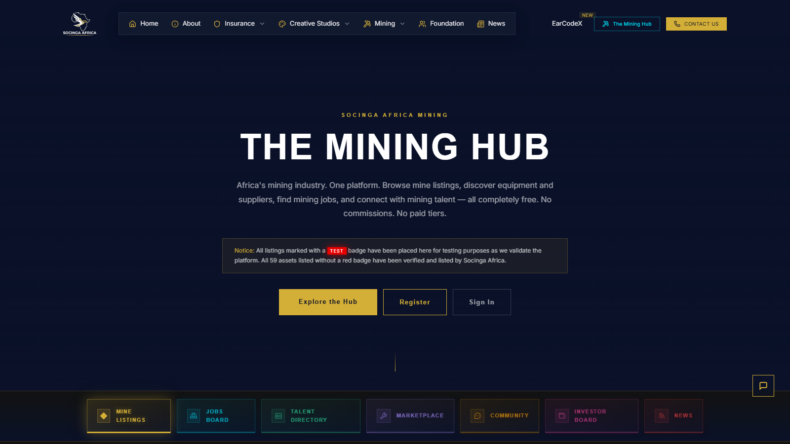

# Socinga Africa Mining Hub

**Live artifact:** [https://www.socinga.africa/mining-hub](https://www.socinga.africa/mining-hub)  
**Portfolio role:** Mining marketplace, stakeholder platform, investment-sector digital infrastructure  
**Source posture:** Public enterprise route with commercial implementation kept controlled.

_Generated portfolio visual; not a confidential product screenshot._

## Public Demo Evidence

_Public live artifact screenshot captured on June 4, 2026._

## Overview

The Socinga Africa Mining Hub is a public enterprise route for regional mining assets, marketplace-style positioning, investor communication, listings concepts, and sector-specific stakeholder navigation.

## My Role

I contributed to the information architecture, public narrative, platform positioning, and stakeholder-facing structure for the mining sector surface.

## What This Demonstrates

- Mining-sector platform and marketplace thinking.
- Ability to connect investor, broker, asset-owner, and public communication needs.
- Public-facing enterprise UX for commercially sensitive sectors.

## Technical Proof

- **Stack and delivery signals:** Mining marketplace information architecture, stakeholder navigation, listings concept framing, investor communication flow, and enterprise-route presentation.
- **Public evidence:** Public mining hub route, listings/marketplace framing, investor-facing sections, and connection to the wider Socinga enterprise site.
- **Confidentiality boundary:** Public review must avoid private mining records, financial assumptions, broker conversations, transaction data, coordinates, credentials, and infrastructure detail.

## Public Review Context

The live route presents marketplace, listings, and investor-facing sections. This case study pairs with the Socinga Africa Enterprise Website case study for broader platform context.

## Confidentiality

The public route is suitable for review. Private mining records, financial assumptions, broker conversations, transaction data, and infrastructure details remain controlled separately.

## Request Walkthrough

Private walkthroughs are available where confidentiality allows: [hello@nwhite.systems](mailto:hello@nwhite.systems?subject=Portfolio%20walkthrough%20-%20Socinga%20Mining%20Hub)
