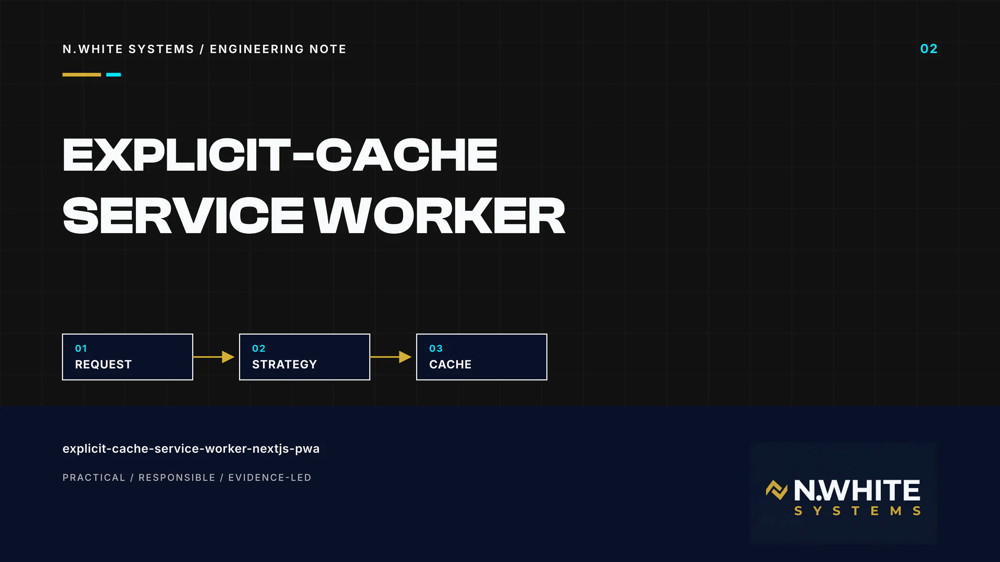
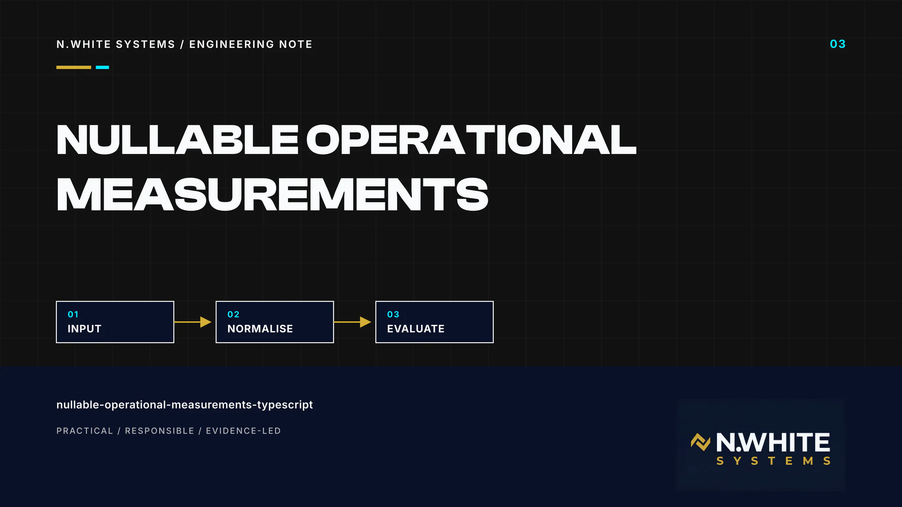

# N.White Systems Engineering Notes

This collection presents three evidence-bounded engineering notes by Whitemore Ngwira. They are maintained on GitHub as public technical reading material and are not published as articles on the N.White Systems website.

Each note separates observed behaviour from inference, links to the exact public source revisions used, records material limitations, and keeps confidential implementation detail outside this repository.

## Notes

### [A Fail-Closed Public Repository Hygiene Gate: What It Checks — and What It Does Not](fail-closed-public-repository-hygiene-gate.md)

A source-pinned examination of a deliberately narrow repository-publication gate: its manual trigger, locally reproduced checks, useful failure conditions and essential limitations.

[Read the repository-hygiene note](fail-closed-public-repository-hygiene-gate.md)

### [An Explicit-Cache Service Worker for a Next.js PWA — Without Caching API Responses](explicit-cache-service-worker-nextjs-pwa.md)

A revision-specific review of a constrained offline-shell strategy: explicit shell assets, network-first navigations, cache-first static files, network-only API traffic and the production safeguards still required.

[Read the service-worker note](explicit-cache-service-worker-nextjs-pwa.md)

### [Nullable Operational Measurements in TypeScript: Preserve Zero, Reject Invalid Input](nullable-operational-measurements-typescript.md)

A practical analysis of blank, null, zero and invalid numeric states, with tests and probes showing why runtime validation must surround TypeScript unions and rule evaluators.

[Read the nullable-measurements note](nullable-operational-measurements-typescript.md)

## Evidence and safety boundary

These notes use only sanitised public evidence. They do not publish production source code, credentials, client information, private dashboards or confidential operational records. Results apply only to the pinned revisions and stated checks; they are not production-readiness, security-clearance, field-deployment or high-stakes decision claims.

Supporting source links and visual provenance are recorded inside each note. The visual package uses N.White Systems branding and includes no invented client metric or client interface.

## Rights and third-party attribution

Copyright © 2026 Whitemore Ngwira / N.White Systems. All rights reserved. The notes and N.White Systems visuals may be viewed and linked for portfolio, hiring and professional evaluation; no open-source licence is granted for them. See [Copyright and Usage Rights](../../COPYRIGHT.md).

Cited source repositories retain their own licences and usage rights. The [Inter SIL Open Font Licence 1.1](third-party-licences/Inter-OFL-1.1.txt) applies only to the referenced font software and does not license these notes or their visuals.

[Return to the public portfolio index](../../README.md)
