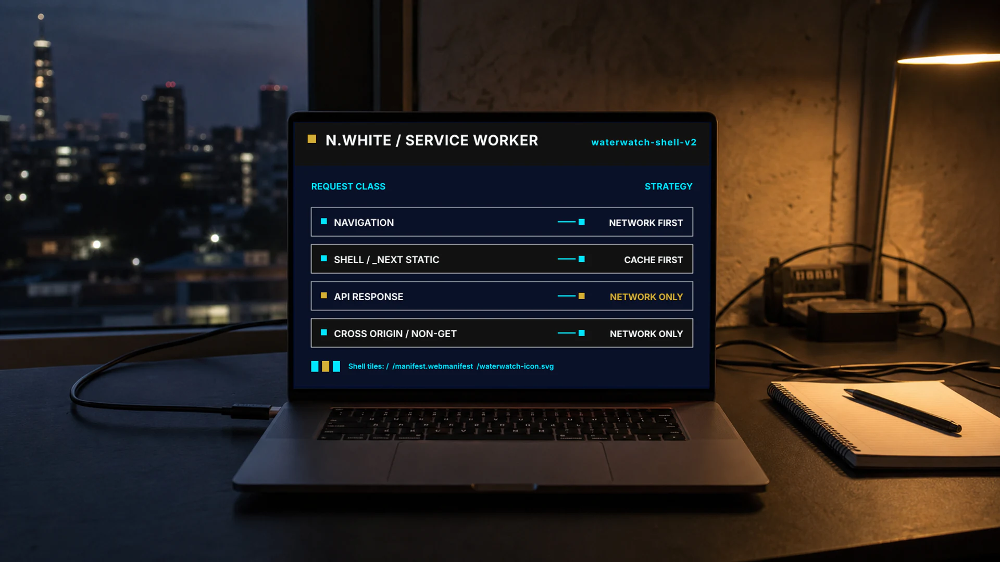
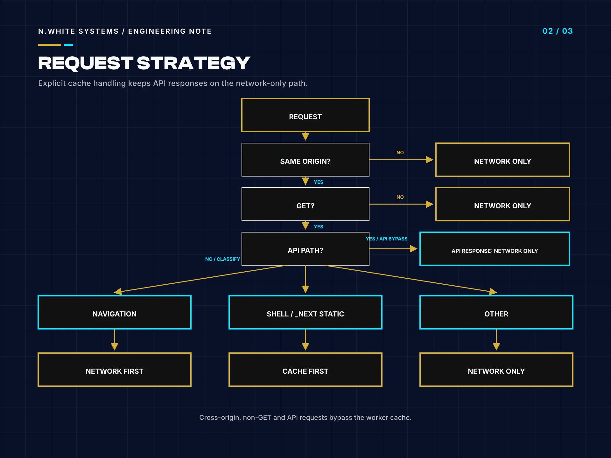
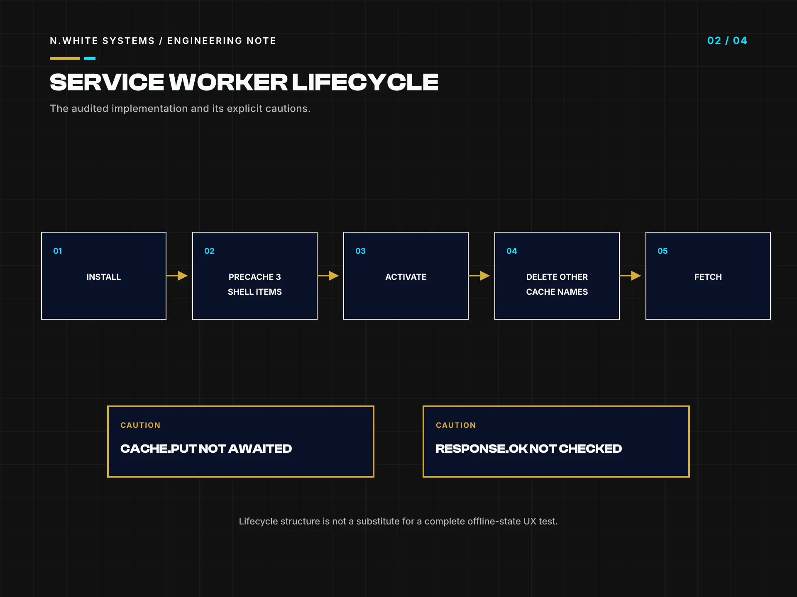

# An Explicit-Cache Service Worker for a Next.js PWA — Without Caching API Responses

> **Repository-only publication.** This engineering note is maintained on GitHub for public technical review. It is not published as an article on the N.White Systems website.

- **Author:** Whitemore Ngwira
- **Repository edition:** 2 Aug 2026
- **Evidence checked:** 2026-08-01T22:37:51+02:00
- **Reading time:** 10 min read

**Evidence boundary:** I reviewed the pinned public source, reran its repository verification and observed one localhost service-worker session through the Codex built-in browser. This is a bounded engineering note, not a claim of production readiness, complete offline support or mobile-device coverage.

A service worker can make a web application feel resilient, but its usefulness depends less on the word offline and more on the precision of its cache boundary. The public Community WaterWatch Zimbabwe concept demonstrator uses a short worker that names three shell resources, handles same-origin GET requests and deliberately leaves every other request to the browser. That small surface is easier to inspect than a general cache-everything recipe.

I reviewed the implementation at commit 495afe1359215c818b4bf8dee77258cce1cdf0ca. I then ran the repository's verification command in a clean detached clone and observed one localhost production build through the Codex built-in browser. The repository checks passed lint, TypeScript, four Node tests and a Next.js 16.2.12 build. Separately, the browser showed an activated worker, the named cache, the explicit shell entries and a cached-shell fallback after the local server stopped.

Those observations do not turn this concept demonstrator into a complete offline system. Only the demonstration queue count persists; records and synchronisation are simulated. The browser session covered one fixed desktop viewport, not a mobile device matrix, and the visible connection label did not reflect the stopped server. I therefore treat the worker as a readable architectural pattern with a documented evidence boundary, not as a reusable production subsystem.

## Key takeaways

- The installation allowlist contains only /, /manifest.webmanifest and /waterwatch-icon.svg; the fetch path attempts to add requested Next.js static chunks to the same named cache, and one observed session showed those chunks present.
- Navigations are network-first with the cached root shell as a failure fallback, while allowlisted shell and /_next/static requests are cache-first.
- API responses remain network-only because they are outside the allowlist; one built-in-browser probe confirmed that /api/health was not added to Cache Storage.
- The worker's unreturned cache.put path, missing response.ok check, broad activation deletion, untracked clients.claim promise and silent registration failure need deliberate treatment before production use.
- A cached shell is not durable offline data: this demonstrator stores only a queue count and simulates records, receipts, conflicts and synchronisation.

## What problem is this constrained offline shell trying to solve?

The demonstrator is designed around an operational constraint: a user may lose connectivity while moving through a field-oriented interface. A cached application shell can keep the explanatory interface available and preserve orientation when a navigation request fails. It can also reduce repeat downloads for stable assets that the developer has deliberately admitted to the cache.

The implementation chooses a narrow starting point. CACHE_NAME is waterwatch-shell-v2, and APP_SHELL contains exactly three entries: /, /manifest.webmanifest and /waterwatch-icon.svg. The install handler opens that cache, calls addAll(APP_SHELL) and passes the resulting promise to event.waitUntil. If any required entry cannot be fetched, the installation promise rejects rather than quietly declaring the initial shell complete. The handler also calls skipWaiting, which asks the new worker to move towards activation without waiting for every old page to close.

That is an application-shell decision, not an offline-data architecture. The React demonstrator stores waterwatch-demo-queue in local storage, but the value is only a numeric queue count. Its own interface says complete records, server submission and production synchronisation are not implemented. A saved count cannot reconstruct a form, prove receipt, resolve a conflict or protect sensitive information. Durable offline work would require a separately designed record store, schema migration, encryption and access rules, idempotent synchronisation, receipts, conflict handling, revocation and tested recovery. Keeping that distinction visible prevents a working shell from being presented as a working offline operation.

**References for this section**

- [Community WaterWatch worker at the audited commit](https://github.com/whitemorengwira/community-waterwatch-zw/blob/495afe1359215c818b4bf8dee77258cce1cdf0ca/public/sw.js)
- [Community WaterWatch README and demonstrator boundary](https://github.com/whitemorengwira/community-waterwatch-zw/blob/495afe1359215c818b4bf8dee77258cce1cdf0ca/README.md)

## How do install, activate and fetch divide responsibility?

The worker separates three responsibilities. Installation establishes the minimum named shell. During activation, the cache-deletion promise is passed to event.waitUntil, while clients.claim() is called separately and its promise is neither returned nor added to that tracked work. The source initiates both operations, but it does not establish a deletion-then-claim sequence. Fetch handling decides whether the worker should intercept a request at all and, if so, whether to prefer the network or Cache Storage.

That lifecycle is compact enough to reason about, but compact does not mean consequence-free. The activation handler enumerates every Cache Storage name for the origin and deletes every name other than the current one. In a single-purpose demonstrator that may be acceptable. On an origin shared by another application or worker, the same rule could remove data it does not own. A production design should namespace cache ownership, document migrations and test upgrade and rollback paths rather than assuming every other name is stale.

The browser observation confirmed one successful path: /sw.js reached the activated state, controlled the page and exposed the expected waterwatch-shell-v2 cache. The three explicit shell paths were present, alongside Next.js static chunks fetched during use. That observation came from one localhost production build and one browser session. It was not an automated lifecycle suite and did not exercise a waiting worker, two open tabs, a version transition, a failed install, a partially populated cache, quota pressure, revocation or failure of the untracked clients.claim() promise. Repository verification and browser lifecycle evidence therefore remain separate records: the clean npm run verify result proves lint, type, unit-test and build outcomes, while the manual browser session proves only the state it actually observed.

*Deterministic diagram of the audited request boundary; it is not runtime telemetry.*

**References for this section**

- [Pinned service-worker source](https://github.com/whitemorengwira/community-waterwatch-zw/blob/495afe1359215c818b4bf8dee77258cce1cdf0ca/public/sw.js)

## Why are navigations network-first while shell assets are cache-first?

The fetch handler first rejects work that does not belong to its boundary. Non-GET methods return immediately. A URL is constructed from the request, and a different origin also returns immediately. That same-origin GET boundary is important: the worker does not attempt to cache cross-origin fonts, analytics, external APIs or form submissions.

Navigation requests take the network-first branch. The handler calls fetch(event.request) and falls back to caches.match('/') only when the network promise rejects. This favours a current server-rendered response while keeping a minimal shell for an unavailable server. It does not provide a route-specific offline page, and an HTTP error response is still a resolved fetch rather than a network exception, so the fallback is not a general error-page mechanism.

Non-navigation requests are narrower again. The worker proceeds only when the path is in the three-item application shell or begins with /_next/static/. Those resources use cache-first lookup. A hit returns immediately. A miss goes to the network, clones the response and attempts a cache write before returning the original response; that write is not awaited by the fetch event. This is a pragmatic way to admit build chunks as they are requested without trying to predict their hashed names at install time.

The distinction is deliberate: current documents benefit from a network attempt, while immutable-looking framework chunks and named shell resources benefit from reuse. It also means the first request for a chunk still depends on the network. A first-time visitor with no populated cache has no offline guarantee, and a new build can introduce assets the current worker has not yet seen. Clear cache strategy names help, but release testing must cover the transition between versions rather than only a warm cache after one successful visit.

**References for this section**

- [Service-worker request-routing implementation](https://github.com/whitemorengwira/community-waterwatch-zw/blob/495afe1359215c818b4bf8dee77258cce1cdf0ca/public/sw.js)

## Why do API responses remain outside this worker cache?

There is no special API regular expression in the worker. The stronger rule is an explicit positive allowlist. After the method, origin and navigation decisions, only the three shell paths and /_next/static/ continue into Cache Storage. A request such as /api/health matches none of those paths, so the handler returns without calling respondWith. From this service worker's perspective, API responses remain network-only and the browser performs its normal fetch.

I verified that boundary narrowly. In the built-in browser, the localhost /api/health request returned HTTP 200. Comparing the observed cache entries before and after the probe showed that the probed /api/health response did not enter Cache Storage. I do not generalise that single observation into proof about every future endpoint, browser or deployment configuration. The source allowlist supports the wider architectural explanation; the runtime observation supports only the exact response that was inspected.

Avoiding API caching here is especially sensible because the demonstrator does not have an authenticated offline-data protocol. Caching a sensitive response introduces questions about user identity, logout and revocation, shared devices, expiry, encryption, schema changes, storage clearing and whether a previous response may be shown to a different session. Those questions cannot be answered by adding an API route to a shell list.

The same boundary also protects the article from a common overclaim. The cached page shell rendered after the local server listener was stopped, but the interface continued to label itself Online. The shell's availability did not prove data freshness or connection awareness. UI status, durable writes and synchronisation each need their own state machines and evidence. A worker can support those systems, but it cannot substitute for them.

*The diagram separates observed behaviour from review cautions; it is not production monitoring.*

**References for this section**

- [Worker allowlist and fetch boundary](https://github.com/whitemorengwira/community-waterwatch-zw/blob/495afe1359215c818b4bf8dee77258cce1cdf0ca/public/sw.js)
- [Client registration and queue-count implementation](https://github.com/whitemorengwira/community-waterwatch-zw/blob/495afe1359215c818b4bf8dee77258cce1cdf0ca/src/components/waterwatch-demo.tsx#L1474-L1492)

## What would I change before using the pattern in a production service?

I would keep the explicit-cache principle and strengthen the lifecycle around it. First, the static miss branch opens the cache and calls cache.put, but the promise is not returned to the fetch chain or attached to event.waitUntil. The response can reach the page while the write remains unfinished, and a worker termination can interrupt the write. The code also does not check response.ok before cloning and caching, so an eligible error response could be stored. Both behaviours deserve tests and an intentional policy.

Second, I would replace broad activation deletion with ownership-aware cache migration. I would define what must happen when a release is rolled back, when two tabs use different worker versions and when a user signs out. Registration currently catches failure with an empty callback so that the simulator remains usable, but silent failure is poor operational evidence. A production interface should surface an appropriate, non-alarming state and record diagnostics without leaking user data.

Third, there is no automated service-worker lifecycle or offline-browser test in the pinned repository, so I would build one. It should cover cold and warm installs, update waiting and activation, navigation failure, first-request static caching, API exclusion, failed responses, storage eviction, multi-tab behaviour and cache clearing. Device checks should include supported mobile browsers and constrained networks. This evidence run used a fixed 1280 by 720 automation viewport, so it supports no mobile-runtime claim.

Finally, I would treat dependency health separately from functional verification. The clean repository run passed ESLint, TypeScript, four Node tests and the production build. The locked install also reported three unresolved high-severity audit findings. I did not apply an automatic fix in the pinned evidence clone, and the passing build is not dependency-security clearance. Production adoption needs triage against the actual dependency graph, supported upgrades and regression tests.

The useful lesson is not that this worker is finished. It is that a small, positive allowlist gives reviewers a tractable boundary. Preserve that clarity, then add lifecycle ownership, data-specific controls, observable failures and browser evidence proportionate to the service's risk.

**References for this section**

- [Community WaterWatch MIT licence](https://github.com/whitemorengwira/community-waterwatch-zw/blob/495afe1359215c818b4bf8dee77258cce1cdf0ca/LICENSE)
- [Repository verification instructions](https://github.com/whitemorengwira/community-waterwatch-zw/blob/495afe1359215c818b4bf8dee77258cce1cdf0ca/README.md#quality-gates)

## Sources and verification

The links below point to the exact public revisions used for this note. They support the bounded claims made here; they do not imply ownership of third-party work or a broader production-readiness claim.

- [Community WaterWatch service worker — pinned source](https://github.com/whitemorengwira/community-waterwatch-zw/blob/495afe1359215c818b4bf8dee77258cce1cdf0ca/public/sw.js)
- [Community WaterWatch client registration — pinned source](https://github.com/whitemorengwira/community-waterwatch-zw/blob/495afe1359215c818b4bf8dee77258cce1cdf0ca/src/components/waterwatch-demo.tsx#L1474-L1492)
- [Community WaterWatch README — pinned boundary and verification](https://github.com/whitemorengwira/community-waterwatch-zw/blob/495afe1359215c818b4bf8dee77258cce1cdf0ca/README.md)
- [Community WaterWatch MIT licence](https://github.com/whitemorengwira/community-waterwatch-zw/blob/495afe1359215c818b4bf8dee77258cce1cdf0ca/LICENSE)

Visual provenance and downloadable assets

| Role | Asset | Classification | Dimensions |
| --- | --- | --- | --- |
| cover | [explicit-cache-service-worker-nextjs-pwa-0001.webp](assets/explicit-cache-service-worker-nextjs-pwa/explicit-cache-service-worker-nextjs-pwa-0001.webp) | deterministic-composite | 1920 × 1080 |
| hero | [explicit-cache-service-worker-nextjs-pwa-0002.webp](assets/explicit-cache-service-worker-nextjs-pwa/explicit-cache-service-worker-nextjs-pwa-0002.webp) | illustrative-generated | 1920 × 1080 |
| support | [explicit-cache-service-worker-nextjs-pwa-0003.webp](assets/explicit-cache-service-worker-nextjs-pwa/explicit-cache-service-worker-nextjs-pwa-0003.webp) | deterministic-composite | 1920 × 1440 |
| support | [explicit-cache-service-worker-nextjs-pwa-0004.webp](assets/explicit-cache-service-worker-nextjs-pwa/explicit-cache-service-worker-nextjs-pwa-0004.webp) | deterministic-composite | 1920 × 1440 |
| social | [explicit-cache-service-worker-nextjs-pwa-social-1200x630.webp](assets/explicit-cache-service-worker-nextjs-pwa/explicit-cache-service-worker-nextjs-pwa-social-1200x630.webp) | deterministic-composite | 1200 × 630 |

The visual package uses the N.White Systems identity and contains no client dashboard, production interface or confidential operational record.

## Rights and attribution

Copyright © 2026 Whitemore Ngwira / N.White Systems. All rights reserved. This note and the N.White Systems visuals may be viewed and linked for portfolio, hiring and professional evaluation; no open-source licence is granted for them. See [Copyright and Usage Rights](../../COPYRIGHT.md).

Cited source projects retain their own licences and usage rights. The [Inter SIL Open Font Licence 1.1](third-party-licences/Inter-OFL-1.1.txt) applies only to the referenced font software; it does not license this article or its visuals.

[Back to the engineering-notes index](README.md)
