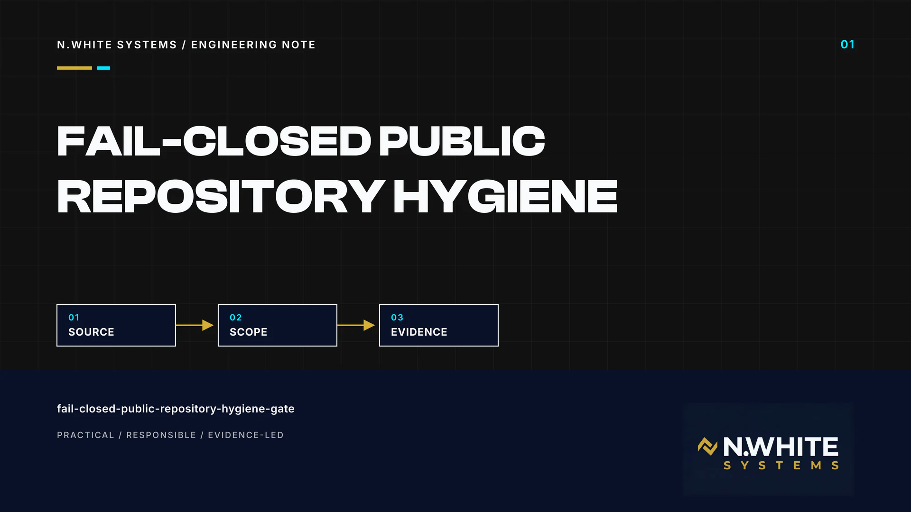
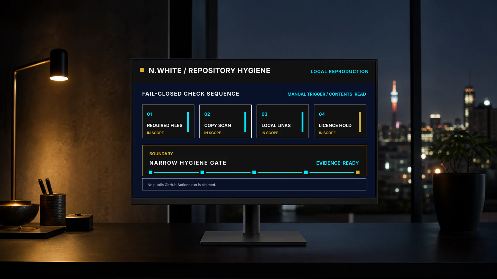
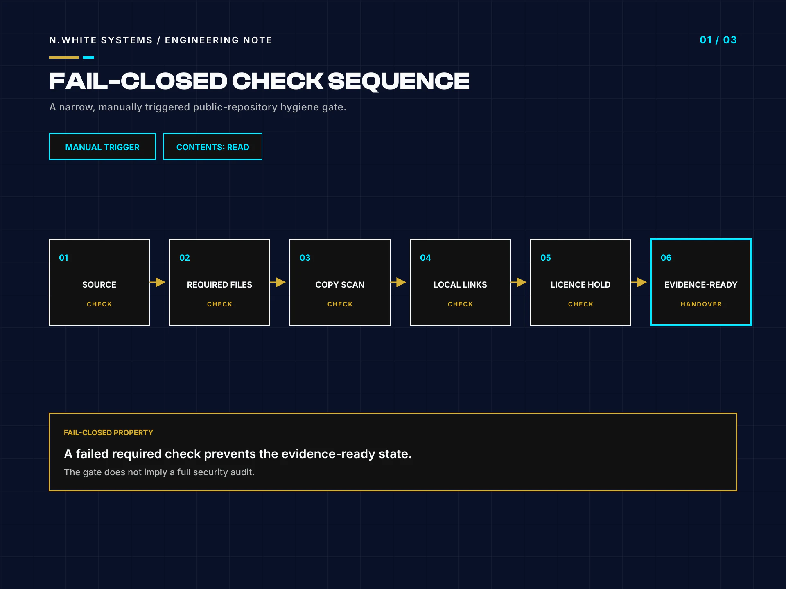
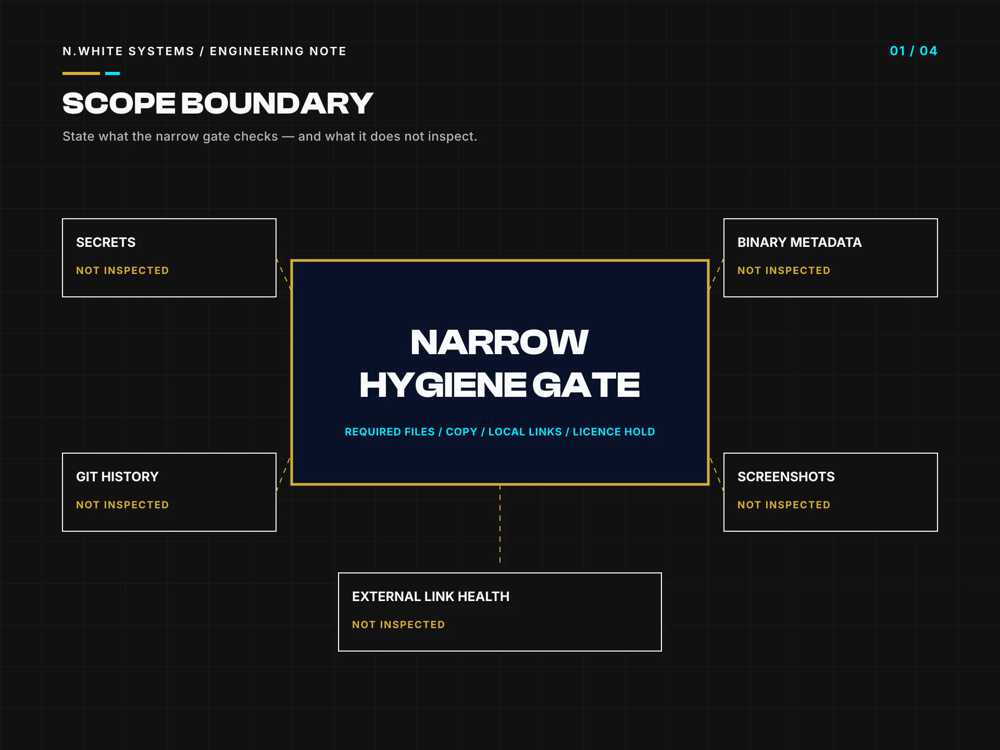

# A Fail-Closed Public Repository Hygiene Gate: What It Checks — and What It Does Not

> **Repository-only publication.** This engineering note is maintained on GitHub for public technical review. It is not published as an article on the N.White Systems website.

- **Author:** Whitemore Ngwira
- **Repository edition:** 2 Aug 2026
- **Evidence checked:** 2026-08-01T22:37:51+02:00
- **Reading time:** 11 min read

**Evidence boundary:** I verified the published source at the two pinned public repository revisions listed below, then reproduced the narrow workflow checks locally. There is no public GitHub Actions run for this workflow, so I make no hosted-run claim and treat every result as revision-specific evidence.

A public repository is a publication surface, not simply a folder that happens to be visible. Its current tree, history, media, automation and explanatory copy can each reveal something the owner did not intend to publish. I therefore treat public release as a controlled decision with explicit evidence rather than assuming that a tidy README makes a repository safe.

This note examines one small GitHub Actions workflow used in two deliberately sanitised portfolio repositories. EarCodeX is a live insurance operations platform developed by N.White Systems. The public repository discussed here is a case-study review surface, not the private working implementation. I also inspected the separate N.White Systems portfolio repository at its pinned revision.

The workflow is intentionally narrow. Its trigger is workflow_dispatch, its declared permission is contents: read, and its job checks required governance files, two prohibited root licence filenames, a blocked-copy expression and local Markdown links. I reproduced those checks locally at the exact source revisions. I did not find a public hosted run to cite, and I do not turn a local pass into a broader security assurance. The useful question is not whether the gate is impressive. It is whether its boundary is explicit, whether it fails on the conditions it owns, and whether the publication process covers everything outside that boundary.

## Key takeaways

- A public-repository gate should fail closed on the small set of release conditions it actually owns, while naming every important condition it does not inspect.
- This manual workflow uses workflow_dispatch with contents: read and requires README.md, CONTRIBUTING.md, CODE_OF_CONDUCT.md, SUPPORT.md, COPYRIGHT.md and SECURITY.md.
- Local reproduction at both pinned revisions found zero missing required files, zero prohibited root licence files, zero blocked-copy matches and zero broken local Markdown links.
- The workflow is not a secret scanner, history review, media inspection, artefact audit, fork review or external-link health check.
- Automation belongs inside a human-owned publication process that reviews the complete tree and history, records evidence and keeps all rights reserved unless an explicit licence decision changes that position.

## Why does a public portfolio repository need a release boundary?

A portfolio repository has at least two audiences: the reviewer I intend to help and every automated or human visitor who can copy what is public. Those audiences see the repository description, files, commit history, branches, releases, Actions output, issue context and linked media. A publication decision therefore has to cover more than whether the default branch builds. A technically correct application tree can still be the wrong thing to expose.

My preferred boundary is a dedicated, sanitised case-study repository. Its purpose is to explain a problem, my role, the public architecture, approved evidence and useful lessons without transferring a private implementation into a public channel. The N.White Systems PUBLIC_DISCLOSURE_POLICY.md states this directly: working repositories are private by default, while public proof belongs in a separate review surface whose contents have been deliberately approved. That distinction protects client confidentiality, personal information, credentials, private dashboards and proprietary operating detail without weakening the technical story.

A release boundary also needs an explicit rights position. The two audited repositories intentionally contain COPYRIGHT.md but no root LICENSE or LICENSE.md. Their copyright notice says all rights reserved and grants no open-source licence. The workflow reinforces that decision by rejecting either root licence filename until there has been explicit approval. Absence is not an invitation to reuse the material, and a public GitHub URL does not turn a portfolio into an open-source template.

The automated gate is one enforcement point for that boundary. It can stop publication work when a required file disappears or a defined copy pattern appears. It cannot decide whether a screenshot is safe, whether a commit removed a secret from history, or whether the repository itself is the right public surface. I keep those questions with a named human owner because automation should support the publication decision, not silently replace it.

**References for this section**

- [N.White Systems — Public Portfolio Disclosure Policy at the audited revision](https://github.com/whitemorengwira/nwhitesystems/blob/7667775485c39e23d16a9dee5e9ddc97f7a34e60/PUBLIC_DISCLOSURE_POLICY.md)
- [N.White Systems — Copyright and usage rights at the audited revision](https://github.com/whitemorengwira/nwhitesystems/blob/7667775485c39e23d16a9dee5e9ddc97f7a34e60/COPYRIGHT.md)

## What does this narrow manual gate actually check?

The workflow has a single manual trigger: workflow_dispatch. It declares permissions as contents: read, then runs one Ubuntu job called Markdown and public copy with a ten-minute timeout. That shape is appropriately modest. It does not request write access, publish a release or alter repository state. A person chooses when to invoke it, and the job either completes every command or exits on the first owned failure.

The first step requires six governance files at the repository root: README.md, CONTRIBUTING.md, CODE_OF_CONDUCT.md, SUPPORT.md, COPYRIGHT.md and SECURITY.md. It also rejects root-level LICENSE and LICENSE.md. This is a policy guard, not a licence detector. It preserves the deliberate all rights reserved position represented by COPYRIGHT.md until the owner approves a different licensing decision.

The second step searches Markdown files for a small blocked-copy expression. Its terms are specific to material that should not appear on the approved public review surface, including internal guidance and unfinished-copy markers. A match exits non-zero. The third step parses inline Markdown links, ignores anchors and external schemes, URL-decodes local targets, rejects paths that escape the repository and confirms that the referenced local path exists. The final success message applies only to that local-link check.

I reproduced these operations against nwhitesystems at 7667775485c39e23d16a9dee5e9ddc97f7a34e60 and earcodex-case-study at 342fd3e8ac5c977dd20ca0fda58dc501d1f2b171. In both detached trees the observed counts were zero missing required files, zero prohibited root licence files, zero blocked-copy matches and zero broken local Markdown links. Those are genuine local results at those revisions. There is no public GitHub Actions run for the workflow, so I describe only a local reproduction and do not claim that hosted automation passed.

That phrasing matters. A reproducible check is evidence about specified inputs and commands. It is not retrospective evidence about every earlier commit, every branch or a future revision. Pinning the source makes the statement reviewable and prevents a later file change from silently changing what this article says was tested.

*The diagram represents the workflow's narrow, source-pinned check sequence; it is not a security-certification result.*

**References for this section**

- [N.White Systems — Public Hygiene workflow at the audited revision](https://github.com/whitemorengwira/nwhitesystems/blob/7667775485c39e23d16a9dee5e9ddc97f7a34e60/.github/workflows/public-hygiene.yml)
- [EarCodeX case study — Public Hygiene workflow at the audited revision](https://github.com/whitemorengwira/earcodex-case-study/blob/342fd3e8ac5c977dd20ca0fda58dc501d1f2b171/.github/workflows/public-hygiene.yml)

## Where can copy and local-link checks mislead me?

A blocked-copy scan is useful when its claim remains exact. Here the grep expression inspects Markdown files and recognises a short list of literal or regular-expression patterns. It can stop a known internal heading, an unfinished-work marker or another specifically named phrase from reaching the approved branch. It does not understand meaning. The same words may be legitimate in a public explanation, producing a regex false positive, while a paraphrase, spelling change, encoded form or non-Markdown file can produce a false negative.

That is why I treat the expression as a regression guard for known wording, not a confidentiality classifier. The pattern needs review when policy changes, and every match needs human context. Expanding it indiscriminately would make the gate noisy; leaving it untouched forever would let it drift away from the actual disclosure policy. A useful owner records why each term is blocked and checks whether the surrounding public copy still tells a coherent, truthful story.

The local-link validator has a similarly precise boundary. It confirms that a relative path resolves inside the repository and exists at the pinned checkout. It skips HTTP and HTTPS URLs, mail and telephone links, and same-document anchors. It does not request an external page, validate an anchor on another document, assess redirect quality or decide whether the target content is still accurate. External-link health therefore remains untested. A file can exist locally while containing obsolete or misleading material, and a remote URL can be broken while this job remains green.

Parsing is another limitation. The script uses a regular expression for common inline Markdown links; Markdown permits edge cases, reference definitions, generated documents and embedded HTML that require a fuller parser if they become part of the publication contract. Conversely, requiring a complex parser can add dependency and supply-chain cost to a deliberately small workflow. I would select the smallest validator that covers the repository's documented writing style, then add fixture tests whenever a real syntax case extends that style.

The root licence check also needs literal reading. It rejects only LICENSE and LICENSE.md at the root. It does not inspect nested licence files, SPDX headers, vendored material or dependency notices. COPYRIGHT.md communicates the repository's all rights reserved position, but a complete rights review still has to account for every included asset and third-party component.

**References for this section**

- [N.White Systems — README at the audited revision](https://github.com/whitemorengwira/nwhitesystems/blob/7667775485c39e23d16a9dee5e9ddc97f7a34e60/README.md)
- [EarCodeX case study — README at the audited revision](https://github.com/whitemorengwira/earcodex-case-study/blob/342fd3e8ac5c977dd20ca0fda58dc501d1f2b171/README.md)

## What does the workflow deliberately leave outside its boundary?

The most important property of a narrow gate is an honest outside boundary. This workflow is not a secret scanner. It does not search for credential formats, test whether a token remains valid, inspect platform secret stores or rotate anything. It also does not review Git history. Removing a sensitive file from the current tree does not remove it from earlier commits, cached clones, forks or downloaded archives. Those require separate history review and exposure response.

Media sits outside the check as well. The job does not inspect binary metadata, embedded thumbnails, EXIF fields, document properties, screenshots or video frames. It cannot see a private tab, account name, record, endpoint, browser notification or background window rendered into an image. It also does not open compressed artefacts, release bundles, Actions artefacts or files attached to issues. A repository whose Markdown is clean can therefore still disclose sensitive material through binary content.

The workflow does not enumerate branches, tags, releases or forks. It evaluates the checkout provided by the Actions step, while the public-disclosure policy says that the full current tree and Git history need review. A fork or prior release may preserve material even after the default branch changes. Making a repository private can reduce ongoing visibility, but it cannot retract copies already downloaded. Publication review must happen before exposure and incident response must assume that published data may have escaped the owner's control.

Supply-chain assurance is also outside the claim. The workflow references actions/checkout@v4, which is a tag-pinned checkout rather than a full commit-SHA pin. The job does not attest the runner image, action implementation or future movement of that tag. A higher-assurance environment could pin third-party actions to reviewed immutable commits and record update ownership, but this article does not claim that control exists here.

Finally, the job does not establish external-link health, repository accessibility, accuracy of every statement, absence of personal data or fitness for publication. Its regex can return false results in both directions. Its root licence check does not inventory rights throughout the tree. The boundary diagram marks secrets, Git history, binary metadata, screenshots, external links, artefacts and forks as not inspected so that a green local reproduction cannot be mistaken for a complete disclosure or security review.

*Not inspected means a separate control and named reviewer are still required; it does not mean the risk is absent.*

**References for this section**

- [N.White Systems — Security policy at the audited revision](https://github.com/whitemorengwira/nwhitesystems/blob/7667775485c39e23d16a9dee5e9ddc97f7a34e60/SECURITY.md)
- [EarCodeX case study — Security policy at the audited revision](https://github.com/whitemorengwira/earcodex-case-study/blob/342fd3e8ac5c977dd20ca0fda58dc501d1f2b171/SECURITY.md)

## What publication process belongs around the automated gate?

I place the gate near the end of a publication process, after deciding that a dedicated public case study is appropriate and before announcing the repository. The owner starts by defining the public purpose and approved claims. A reviewer then inspects the full tree, dotfiles, media, documents and generated outputs; checks the repository description and linked destinations; searches the history, branches, tags, releases and artefacts; and confirms that no client, personal, credential or private implementation material is present.

Next comes a rights and attribution review. Every image, font, excerpt and third-party component needs a known basis for inclusion. For these two repositories, the public position is all rights reserved and no open-source licence is granted. The workflow's root licence hold helps preserve that position, but the human reviewer must still confirm that the repository has not absorbed content whose rights conflict with the intended publication. An actual change to licensing deserves an explicit owner decision rather than a convenient copied file.

The automated checks then run against an identified revision. In this article, I pinned each source commit and reproduced the workflow locally because there was no public hosted run. A mature evidence record should retain the revision, workflow content hash, command, environment, exit code and bounded result. It should also say what was not tested. That record allows a reviewer to repeat the owned checks without suggesting that the repository has received a universal security clearance.

After release, I verify the signed-out public view, every intended link and the visible default branch. I confirm that the public description does not advertise source access that the repository does not provide. I keep sensitive reporting private through the documented SECURITY.md channel and avoid asking reporters to expose concerns in public issues. If any implementation repository or confidential material is exposed, the response moves beyond this gate: restrict access, remove links, inspect history, forks, releases and artefacts, rotate affected credentials and publish a separate sanitised case study only after review.

The practical design principle is simple: automate crisp conditions, fail closed when they are violated and leave ambiguous publication judgement with an accountable person. A small gate becomes trustworthy when its evidence and limitations travel together. It becomes dangerous when a green mark is allowed to stand in for review that never happened.

**References for this section**

- [N.White Systems — Public Portfolio Disclosure Policy at the audited revision](https://github.com/whitemorengwira/nwhitesystems/blob/7667775485c39e23d16a9dee5e9ddc97f7a34e60/PUBLIC_DISCLOSURE_POLICY.md)
- [N.White Systems — Security policy at the audited revision](https://github.com/whitemorengwira/nwhitesystems/blob/7667775485c39e23d16a9dee5e9ddc97f7a34e60/SECURITY.md)

## Sources and verification

The links below point to the exact public revisions used for this note. They support the bounded claims made here; they do not imply ownership of third-party work or a broader production-readiness claim.

- [N.White Systems — Public Hygiene workflow](https://github.com/whitemorengwira/nwhitesystems/blob/7667775485c39e23d16a9dee5e9ddc97f7a34e60/.github/workflows/public-hygiene.yml)
- [N.White Systems — Public Portfolio Disclosure Policy](https://github.com/whitemorengwira/nwhitesystems/blob/7667775485c39e23d16a9dee5e9ddc97f7a34e60/PUBLIC_DISCLOSURE_POLICY.md)
- [N.White Systems — Copyright and usage rights](https://github.com/whitemorengwira/nwhitesystems/blob/7667775485c39e23d16a9dee5e9ddc97f7a34e60/COPYRIGHT.md)
- [N.White Systems — Security policy](https://github.com/whitemorengwira/nwhitesystems/blob/7667775485c39e23d16a9dee5e9ddc97f7a34e60/SECURITY.md)
- [N.White Systems — Repository overview](https://github.com/whitemorengwira/nwhitesystems/blob/7667775485c39e23d16a9dee5e9ddc97f7a34e60/README.md)
- [EarCodeX case study — Public Hygiene workflow](https://github.com/whitemorengwira/earcodex-case-study/blob/342fd3e8ac5c977dd20ca0fda58dc501d1f2b171/.github/workflows/public-hygiene.yml)
- [EarCodeX case study — Copyright and usage rights](https://github.com/whitemorengwira/earcodex-case-study/blob/342fd3e8ac5c977dd20ca0fda58dc501d1f2b171/COPYRIGHT.md)
- [EarCodeX case study — Security policy](https://github.com/whitemorengwira/earcodex-case-study/blob/342fd3e8ac5c977dd20ca0fda58dc501d1f2b171/SECURITY.md)
- [EarCodeX case study — Repository overview](https://github.com/whitemorengwira/earcodex-case-study/blob/342fd3e8ac5c977dd20ca0fda58dc501d1f2b171/README.md)

Visual provenance and downloadable assets

| Role | Asset | Classification | Dimensions |
| --- | --- | --- | --- |
| cover | [fail-closed-public-repository-hygiene-gate-0001.webp](assets/fail-closed-public-repository-hygiene-gate/fail-closed-public-repository-hygiene-gate-0001.webp) | deterministic-composite | 1920 × 1080 |
| hero | [fail-closed-public-repository-hygiene-gate-0002.webp](assets/fail-closed-public-repository-hygiene-gate/fail-closed-public-repository-hygiene-gate-0002.webp) | illustrative-generated | 1920 × 1080 |
| support | [fail-closed-public-repository-hygiene-gate-0003.webp](assets/fail-closed-public-repository-hygiene-gate/fail-closed-public-repository-hygiene-gate-0003.webp) | deterministic-composite | 1920 × 1440 |
| support | [fail-closed-public-repository-hygiene-gate-0004.webp](assets/fail-closed-public-repository-hygiene-gate/fail-closed-public-repository-hygiene-gate-0004.webp) | deterministic-composite | 1920 × 1440 |
| social | [fail-closed-public-repository-hygiene-gate-social-1200x630.webp](assets/fail-closed-public-repository-hygiene-gate/fail-closed-public-repository-hygiene-gate-social-1200x630.webp) | deterministic-composite | 1200 × 630 |

The visual package uses the N.White Systems identity and contains no client dashboard, production interface or confidential operational record.

## Rights and attribution

Copyright © 2026 Whitemore Ngwira / N.White Systems. All rights reserved. This note and the N.White Systems visuals may be viewed and linked for portfolio, hiring and professional evaluation; no open-source licence is granted for them. See [Copyright and Usage Rights](../../COPYRIGHT.md).

Cited source projects retain their own licences and usage rights. The [Inter SIL Open Font Licence 1.1](third-party-licences/Inter-OFL-1.1.txt) applies only to the referenced font software; it does not license this article or its visuals.

[Back to the engineering-notes index](README.md)
