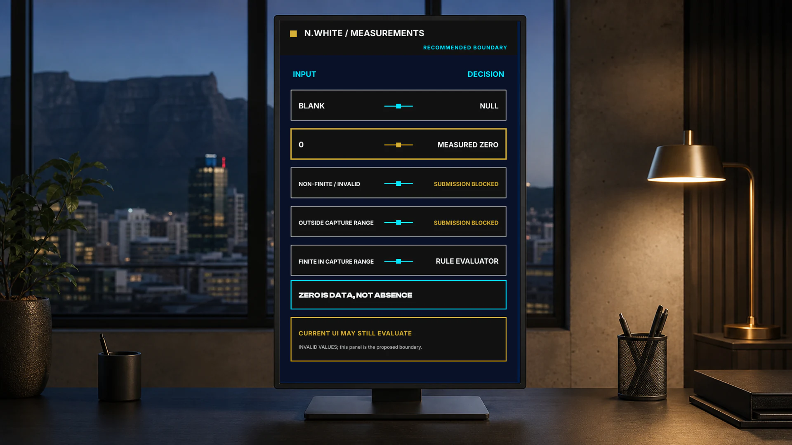
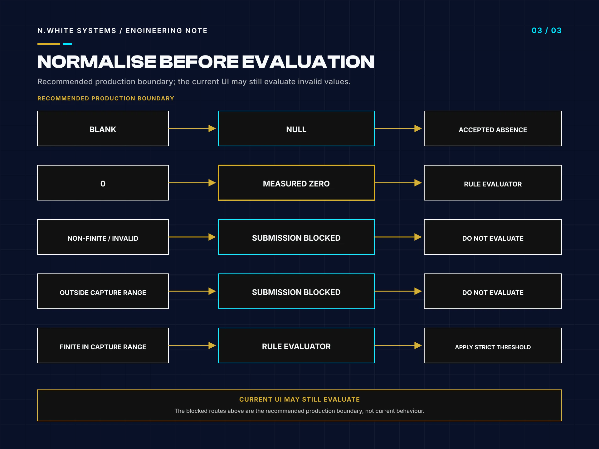
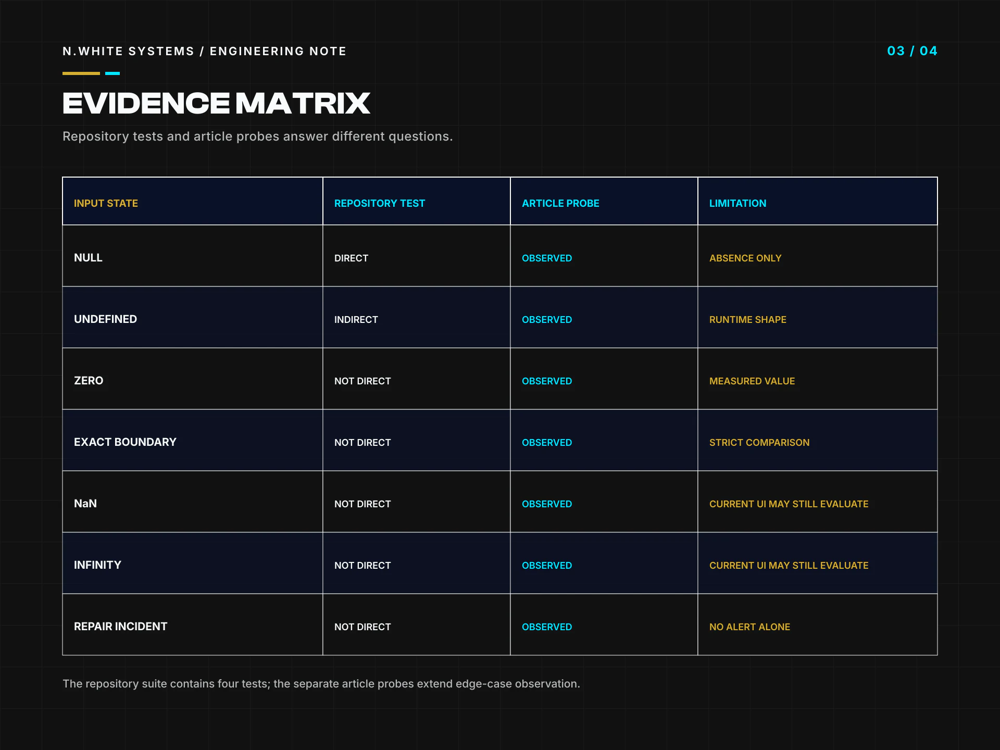

# Nullable Operational Measurements in TypeScript: Preserve Zero, Reject Invalid Input

> **Repository-only publication.** This engineering note is maintained on GitHub for public technical review. It is not published as an article on the N.White Systems website.

- **Author:** Whitemore Ngwira
- **Repository edition:** 2 Aug 2026
- **Evidence checked:** 2026-08-01T22:37:51+02:00
- **Reading time:** 9 min read

**Evidence boundary:** I reviewed and tested the pinned public Community WaterWatch Zimbabwe evaluator and its input boundary with synthetic values only. The rules and thresholds are illustrative; this note is not public-health advice, an AI diagnostic, a field deployment or evidence of production fitness.

Operational forms often make four different states look like one empty-looking box: no measurement was supplied, a genuine zero was recorded, the input cannot be treated as a valid number, or a finite value is ready for evaluation. Collapsing those states produces quiet defects. A truthiness check drops zero, while an unchecked conversion can pass NaN, infinity or an impossible range into logic that was written for measured values.

The public Community WaterWatch Zimbabwe concept demonstrator offers a small example. Its TypeScript WaterReading type allows optional numeric fields to be number | null, and its deterministic evaluator uses value != null before applying illustrative threshold rules. That condition correctly keeps zero. The React capture boundary separately converts a blank string to null and uses Number.isFinite plus permitted ranges before allowing a synthetic record to proceed.

I tested the evaluator at commit 495afe1359215c818b4bf8dee77258cce1cdf0ca. The four repository tests passed. I also ran focused probes for null, zero, exact boundaries, values just beyond them, non-finite numbers and runtime-invalid incident strings. The results show both the value of the nullable pattern and its limit: the evaluator preserves zero, but it is not an input validator. No alert does not mean safe, and a deterministic review signal is not a human decision.

## Key takeaways

- Convert a genuinely blank field to null before numeric conversion; null means unmeasured, not zero.
- Use value != null when zero remains a measured value and must reach deterministic evaluation.
- Reject non-finite and out-of-range input with Number.isFinite and domain-specific bounds before calling the evaluator.
- TypeScript unions do not validate runtime input; JavaScript callers, decoded JSON and unsafe casts can still cross the boundary.
- A rule returning no alert is not a safety statement: thresholds, ownership, evidence and human escalation remain separate concerns.

## Which four states hide inside a numeric form field?

The first state is blank: the user did not provide a measurement. In the demonstrator, an empty string is converted explicitly with expressions such as data.ph === "" ? null : Number(data.ph). That blank-to-null step gives absence a stable representation. It avoids the JavaScript surprise that Number("") is zero, which would manufacture a reading that nobody entered.

The second state is measured zero. Zero can be physically meaningful even when a particular domain later rejects it or asks for review. It must not disappear merely because JavaScript treats it as falsy. The third state is invalid input: NaN, positive or negative infinity, malformed runtime data or a numeric value outside the permitted capture range. Invalid is not missing, and it should not be handed to the rules as though it were an ordinary measurement.

The fourth state is a finite value within the accepted input range. Only then is the value ready for a domain rule to decide whether it belongs inside an illustrative band or needs review. The capture component applies this boundary separately for pH, turbidity, flow and level. It requires pH from 0 to 14, non-negative turbidity and flow, and level from 0 to 100, using Number.isFinite in every case.

These four states support different user messages and different audit evidence. Blank can ask for a measurement or remain deliberately optional. Zero can be recorded and then evaluated. Invalid should explain the correction. A finite value can proceed. Modelling those distinctions explicitly is less glamorous than a dashboard, but it prevents operational meaning from being lost before any business rule runs.

**References for this section**

- [Pinned capture conversion and validation boundary](https://github.com/whitemorengwira/community-waterwatch-zw/blob/495afe1359215c818b4bf8dee77258cce1cdf0ca/src/components/waterwatch-demo.tsx#L598-L637)

## Why does a truthiness check lose a valid zero?

A condition such as if (reading.ph) asks whether the value is truthy. It does not ask whether a measurement exists. 0, null and undefined all take the false branch, so the code can silently treat a recorded zero as though the field were absent. Using a default such as reading.ph || fallback creates the same problem: the fallback replaces zero even though the caller supplied it.

The evaluator instead uses reading.ph != null. In JavaScript, that deliberate loose comparison is true for zero and other values, but false for both null and undefined. The rule then compares pH with the illustrative 6.5 to 8.5 band. The same presence check appears on turbidity, flow percentage and level percentage. This is one of the limited places where != communicates the intended two-value absence test more directly than a truthiness condition.

My probe with every numeric field set to zero confirmed the behaviour. Zero reached the rules. It produced a pH review signal, a low-flow review signal and a low-level review signal. Turbidity zero did not cross its greater-than-five threshold. That outcome is consistent with the source: zero was preserved, then each rule made its own comparison. An omitted reading and an explicit-null reading produced no alerts because neither supplied a measured value.

Preserving zero does not establish that the reading is valid for every operational workflow. The capture layer still owns permitted ranges, units, instrument method and required-field policy. The evaluator owns a smaller question: given a value or explicit absence, which configured review signals follow? Keeping those responsibilities separate makes both the user validation and the rule logic easier to test.

**References for this section**

- [Pinned nullable evaluator implementation](https://github.com/whitemorengwira/community-waterwatch-zw/blob/495afe1359215c818b4bf8dee77258cce1cdf0ca/src/lib/alert-engine.ts)

## Where should finiteness and permitted ranges be enforced?

For a production boundary, I would place finiteness and permitted ranges before the deterministic rule evaluator. The current capture component parses each non-blank field with Number(...), calculates local numeric variables and adds a validation issue when Number.isFinite fails or when the value falls outside its permitted range. Submission remains blocked while those issues exist. However, the demonstrator also calls evaluateReading(...) from parsed form state independently of that submission check, so an invalid value can still reach the evaluator and appear in the interface. The present boundary protects submission; it does not fully isolate displayed rule output from invalid input.

The evaluator's TypeScript type is useful documentation, but TypeScript unions do not validate runtime input. JSON decoding, plain JavaScript, DOM values, unsafe casts and external integrations can still pass values that the compiler never checked. The evaluator accepts invalid numeric values because its comparisons assume a number-like input: NaN makes every ordinary less-than or greater-than comparison false, positive infinity crosses upper comparisons, and negative infinity crosses lower comparisons.

My probes made that boundary visible. Numeric Number.NaN values produced no alert. Positive infinity produced a pH review signal and a critical turbidity signal; negative infinity produced a pH review signal only. Those are mechanical JavaScript comparison results, not meaningful operational judgements. A runtime incident string outside the declared union also passed through without an incident signal.

For a production boundary I would validate the complete object at ingestion, including finite numbers, units, permitted ranges, enumerated strings and relationships between fields. I would retain raw approved evidence separately where governance requires it, but only validated values would reach the evaluator. Errors would be explicit and auditable rather than converted into absence. The rule function can then stay small and deterministic because the caller has honoured a real runtime contract.

*Deterministic input-boundary diagram based on the pinned public source and focused probes.*

**References for this section**

- [Pinned input-boundary implementation](https://github.com/whitemorengwira/community-waterwatch-zw/blob/495afe1359215c818b4bf8dee77258cce1cdf0ca/src/components/waterwatch-demo.tsx#L598-L637)
- [Pinned evaluator type and rules](https://github.com/whitemorengwira/community-waterwatch-zw/blob/495afe1359215c818b4bf8dee77258cce1cdf0ca/src/lib/alert-engine.ts)

## What did the repository tests and article probes actually cover?

The repository contains four Node tests. One confirms that an in-band synthetic reading creates no alert. One confirms that recorded E. coli detection creates one critical review signal. One combines quality, quantity and contamination inputs and checks for six signals without a safety declaration. The fourth confirms that null optional values are not treated as zero. All four passed in the clean verification run, alongside lint, TypeScript and the production build.

I added article-specific probes without changing the pinned source. Omitted values and explicit null values produced no alerts. The all-zero case produced the three review signals described above. The exact tested review boundaries—pH 6.5, turbidity 5, flow 50 and level 30—produced no alert because the comparisons are strict. Values just outside those boundaries produced four review signals.

Turbidity 10 produced review severity; 10.01 produced critical severity because the inner critical comparison is strictly greater than 10. The non-finite probes exposed the missing validation boundary: Number.NaN produced no alert, positive infinity produced pH review plus critical turbidity, and negative infinity produced pH review. A repair incident and a runtime-invalid incident string produced no incident alert because only contamination and outage create incident signals.

This matrix is evidence about these cases, not an exhaustive proof. It does not test every upper boundary, every field combination, locale-specific number entry, unit conversion, property-based invariants or adversarial object shape. It also does not validate the illustrative thresholds against Zimbabwean public-health standards. The useful result is a precise map of what the tested function did, including surprising behaviour that must remain at the input boundary rather than being hidden by a passing headline.

*The matrix records tested synthetic cases and explicit limitations; it is not field evidence.*

**References for this section**

- [Pinned alert-engine tests](https://github.com/whitemorengwira/community-waterwatch-zw/blob/495afe1359215c818b4bf8dee77258cce1cdf0ca/tests/alert-engine.test.ts)
- [Repository verification instructions](https://github.com/whitemorengwira/community-waterwatch-zw/blob/495afe1359215c818b4bf8dee77258cce1cdf0ca/README.md#quality-gates)

## Why must an operational signal remain separate from a human decision?

The function returns review or critical signals with a field and message. It does not diagnose a water source, certify a measurement, choose a response or establish that conditions are acceptable. Its thresholds are explicitly described in the source as demonstration-only rules that require approval through discovery with authorised technical and public-health stakeholders.

No alert does not mean safe. It can mean that optional values were absent, that a value stayed inside one illustrative band, that an invalid value failed to cross a JavaScript comparison, or that the scenario is simply outside the current rules. The evaluator is not an AI diagnostic, and it is not public-health advice. Community WaterWatch Zimbabwe is a self-initiated synthetic concept demonstrator, not a field deployment. Its names, readings and events are synthetic.

An operational design should preserve the evidence chain around any signal: who collected the sample, which approved instrument or kit produced the reading, units, lot or calibration information, times, location and consented supporting evidence. A runtime-valid measurement can then enter configured deterministic rules. The resulting signal should have an accountable human owner, acknowledgement, permitted actions, escalation, outcome and audit trail. Higher-consequence decisions need proportionate professional authority and confirmation rather than a more emphatic colour.

I also keep user-interface validation separate from domain approval. A finite pH from 0 to 14 is syntactically plausible for the capture form; it is not automatically trusted, representative or sufficient for a public-health decision. Likewise, a test suite proves code behaviour against selected examples, not operational effectiveness. The responsible engineering pattern is therefore layered: blank-to-null conversion, finite and range validation, deterministic evaluation, explicit human review and evidence-backed response. Each layer should state what it knows and refuse claims that belong to the next one.

**References for this section**

- [Community WaterWatch responsible-use boundary](https://github.com/whitemorengwira/community-waterwatch-zw/blob/495afe1359215c818b4bf8dee77258cce1cdf0ca/README.md#responsible-use-notice)
- [Community WaterWatch MIT licence](https://github.com/whitemorengwira/community-waterwatch-zw/blob/495afe1359215c818b4bf8dee77258cce1cdf0ca/LICENSE)

## Sources and verification

The links below point to the exact public revisions used for this note. They support the bounded claims made here; they do not imply ownership of third-party work or a broader production-readiness claim.

- [Community WaterWatch alert engine — pinned source](https://github.com/whitemorengwira/community-waterwatch-zw/blob/495afe1359215c818b4bf8dee77258cce1cdf0ca/src/lib/alert-engine.ts)
- [Community WaterWatch alert-engine tests — pinned source](https://github.com/whitemorengwira/community-waterwatch-zw/blob/495afe1359215c818b4bf8dee77258cce1cdf0ca/tests/alert-engine.test.ts)
- [Community WaterWatch capture input boundary — pinned source](https://github.com/whitemorengwira/community-waterwatch-zw/blob/495afe1359215c818b4bf8dee77258cce1cdf0ca/src/components/waterwatch-demo.tsx#L598-L637)
- [Community WaterWatch MIT licence](https://github.com/whitemorengwira/community-waterwatch-zw/blob/495afe1359215c818b4bf8dee77258cce1cdf0ca/LICENSE)

Visual provenance and downloadable assets

| Role | Asset | Classification | Dimensions |
| --- | --- | --- | --- |
| cover | [nullable-operational-measurements-typescript-0001.webp](assets/nullable-operational-measurements-typescript/nullable-operational-measurements-typescript-0001.webp) | deterministic-composite | 1920 × 1080 |
| hero | [nullable-operational-measurements-typescript-0002.webp](assets/nullable-operational-measurements-typescript/nullable-operational-measurements-typescript-0002.webp) | illustrative-generated | 1920 × 1080 |
| support | [nullable-operational-measurements-typescript-0003.webp](assets/nullable-operational-measurements-typescript/nullable-operational-measurements-typescript-0003.webp) | deterministic-composite | 1920 × 1440 |
| support | [nullable-operational-measurements-typescript-0004.webp](assets/nullable-operational-measurements-typescript/nullable-operational-measurements-typescript-0004.webp) | deterministic-composite | 1920 × 1440 |
| social | [nullable-operational-measurements-typescript-social-1200x630.webp](assets/nullable-operational-measurements-typescript/nullable-operational-measurements-typescript-social-1200x630.webp) | deterministic-composite | 1200 × 630 |

The visual package uses the N.White Systems identity and contains no client dashboard, production interface or confidential operational record.

## Rights and attribution

Copyright © 2026 Whitemore Ngwira / N.White Systems. All rights reserved. This note and the N.White Systems visuals may be viewed and linked for portfolio, hiring and professional evaluation; no open-source licence is granted for them. See [Copyright and Usage Rights](../../COPYRIGHT.md).

Cited source projects retain their own licences and usage rights. The [Inter SIL Open Font Licence 1.1](third-party-licences/Inter-OFL-1.1.txt) applies only to the referenced font software; it does not license this article or its visuals.

[Back to the engineering-notes index](README.md)
